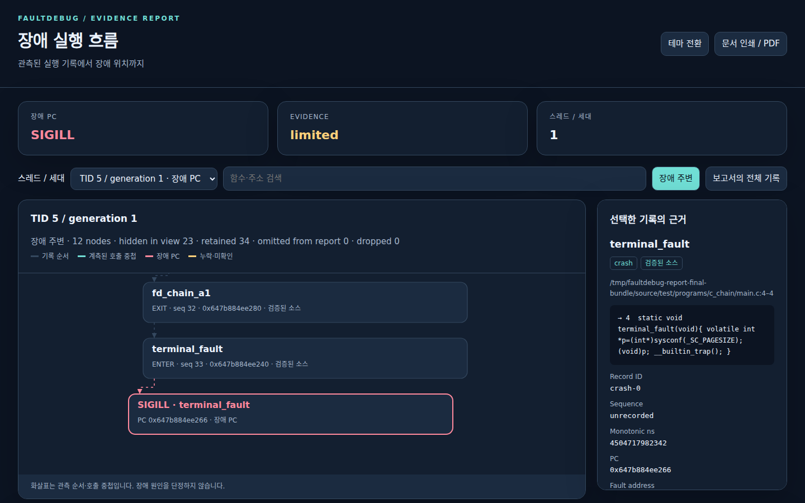

# FaultDebug 한국어 안내

[English](README.md) · **한국어** · [简体中文](README.zh-CN.md) · [日本語](README.ja.md)

FaultDebug는 C/C++ 프로그램의 실행 중 함수 이벤트를 제한된 메모리에
기록하고, 종료 후 로컬에서 `.fault` 증거 파일을 수집·검사하는 도구입니다.
Clang/CMake 빌드 연동, Python CLI, 읽기 전용 MCP 검사기를 제공합니다.


> 수집되지 않은 이벤트를 추정하지 않습니다. overflow, 불완전한 trace,
> source provenance 불일치를 결과에 드러냅니다.

## 현재 상태

최신 후보 버전은 [`v1.2.0-rc.1`](https://github.com/lsh235/FalutDebugMCP/releases/tag/v1.2.0-rc.1)입니다.
core와 gRPC 로컬·GitHub Actions 게이트는 통과했지만, 독립 최종 검토는 아직
실행 전입니다. 30분 soak trace는 344,793개 이벤트 손실과 9,276개의 불안정한
snapshot을 기록해 불완전합니다. 정식 `v1.2.0` 릴리스로 간주하지 마세요.

## 빠른 시작

지원 기준은 Ubuntu 24.04 x86_64, Python 3.12, Clang 18, CMake 3.20 이상,
Ninja입니다.

```sh
git clone https://github.com/lsh235/FalutDebugMCP.git
cd FalutDebugMCP
sudo apt-get update
sudo apt-get install clang-18 llvm-18-tools cmake ninja-build python3.12 python3.12-venv
python3.12 -m venv .venv
.venv/bin/python -m pip install --upgrade pip
.venv/bin/python -m pip install -e .
cmake -S . -B build -G Ninja \
  -DCMAKE_C_COMPILER=clang-18 \
  -DCMAKE_CXX_COMPILER=clang++-18 \
  -DFAULTDEBUG_PYTHON_EXECUTABLE="$PWD/.venv/bin/python" \
  -DFAULTDEBUG_BUILD_TESTS=ON
cmake --build build --parallel 2
```

환경을 확인하고 예제를 실행합니다.

```sh
.venv/bin/fault-debug doctor
.venv/bin/fault-debug run --artifact-dir artifacts -- build/test/fd_c_chain 16
```

정상 종료에서는 기본적으로 `.fault` 파일을 만들지 않습니다. SIGSEGV 수집은
다음처럼 실행합니다.

```sh
.venv/bin/fault-debug run --artifact-dir artifacts -- build/test/fd_signals 11
```

수집한 파일을 검사하려면 `.venv/bin/fault-debug inspect artifacts/fault-<pid>.fault`를
사용하세요. source 기반 분석에는 빌드에서 생성한 source bundle이 필요합니다.

장애 문서와 탐색형 실행 흐름 보고서를 생성할 수 있습니다.

```sh
.venv/bin/fault-debug fault-report artifacts/fault-<pid>.fault \
  --bundle build/bundle --output reports/incident-001 --language ko
```

`report.html`에서 장애 PC, 호출·복귀 기록, 누락 구간을 확인하고 함수를
선택하면 검증된 소스 근거를 볼 수 있습니다. `report.md`는 문서,
`report.json`은 구조화된 근거이며 HTML 문서를 인쇄해 PDF로 저장할 수도
있습니다. 스레드 선택·검색·테마 전환을 지원합니다. 기록 순서와 정적
후보만으로 원인을 확정하지 않습니다. 자세한 내용은
[보고서 안내](docs/fault-flow-report.md)를 참고하세요.



## 증거 해석

- **관측됨:** artifact에 실제 저장된 committed runtime record입니다.
- **정적 후보:** source나 compile database에서 찾은 가능성으로, 실행 증거가 아닙니다.
- **미해결:** 누락·모호함·손실·불일치로 확정할 수 없는 결과입니다.

부모 PID, 함수 이름, trace ID, 시각만으로 프로세스 사이의 인과관계를
확정하지 않습니다. `.fault` 및 source bundle에는 민감한 코드와 경로가 들어갈
수 있으므로 공개 이슈에 올리기 전에 정리하세요.

## 더 알아보기

- [전체 README 및 명령 예제](README.md)
- [v1.2 계획과 수락 기준](docs/next-version-v1.2.md)
- [빌드 및 CTest](test/README.md)
- [기여 안내](CONTRIBUTING.md) · [보안 정책](SECURITY.md)
