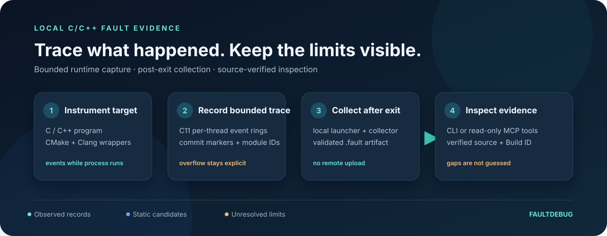

# FaultDebug 中文指南

[English](README.md) · [한국어](README.ko.md) · **简体中文** · [日本語](README.ja.md)

FaultDebug 用于本地记录和检查 C/C++ 程序的运行时故障证据。轻量级 C11
运行时在有界内存中记录函数进入/退出事件；目标进程退出后，Python 启动器
收集并验证共享内存 trace，并在受支持的致命信号或部分终止情况下生成
`.fault` 文件。项目还提供 Clang/CMake 集成、CLI 和只读 MCP 检查器。



> FaultDebug 不会猜测丢失的事件。overflow、不完整 trace 和 source
> provenance 不匹配都会明确显示。

## 项目状态

当前候选版本为 [`v1.2.0-rc.1`](https://github.com/lsh235/FalutDebugMCP/releases/tag/v1.2.0-rc.1)。
core 与 gRPC 的本地及 GitHub Actions gate 均已通过，但独立最终审查尚未完成。
30 分钟 soak trace 丢失了 344,793 个事件，并包含 9,276 条不稳定 snapshot
记录，因此 trace 不完整。该版本不是正式的 `v1.2.0` 稳定版。

## 快速开始

支持环境：Ubuntu 24.04 x86_64、Python 3.12、Clang 18、CMake 3.20 以上和
Ninja。

```sh
git clone https://github.com/lsh235/FalutDebugMCP.git
cd FalutDebugMCP
sudo apt-get update
sudo apt-get install clang-18 llvm-18-tools cmake ninja-build python3.12 python3.12-venv
python3.12 -m venv .venv
.venv/bin/python -m pip install --upgrade pip
.venv/bin/python -m pip install -e .
cmake -S . -B build -G Ninja \
  -DCMAKE_C_COMPILER=clang-18 \
  -DCMAKE_CXX_COMPILER=clang++-18 \
  -DFAULTDEBUG_PYTHON_EXECUTABLE="$PWD/.venv/bin/python" \
  -DFAULTDEBUG_BUILD_TESTS=ON
cmake --build build --parallel 2
```

检查环境并运行正常示例：

```sh
.venv/bin/fault-debug doctor
.venv/bin/fault-debug run --artifact-dir artifacts -- build/test/fd_c_chain 16
```

正常退出默认不会创建 `.fault` 文件。要测试 SIGSEGV 采集：

```sh
.venv/bin/fault-debug run --artifact-dir artifacts -- build/test/fd_signals 11
```

使用 `.venv/bin/fault-debug inspect artifacts/fault-<pid>.fault` 查看 artifact。
基于 source 的检查需要构建时生成的已验证 source bundle。

## 如何理解结果

- **Observed（已观测）：** artifact 中实际保存的 committed runtime records。
- **Static candidates（静态候选）：** 从 source 或 compile database 得到的可能路径，
  不代表程序实际执行过。
- **Unresolved（未解决）：** 因缺失、歧义、丢失或校验失败而无法确认的证据。

仅凭父 PID、函数名、trace ID 或时间戳不能证明跨进程因果关系。`.fault`
文件和 source bundle 可能包含敏感代码与路径，公开 issue 前请先脱敏。

## 更多文档

- [English 完整文档和命令示例](README.md)
- [v1.2 开发计划与验收标准](docs/next-version-v1.2.md)
- [构建和测试](test/README.md)
- [贡献指南](CONTRIBUTING.md) · [安全政策](SECURITY.md)
