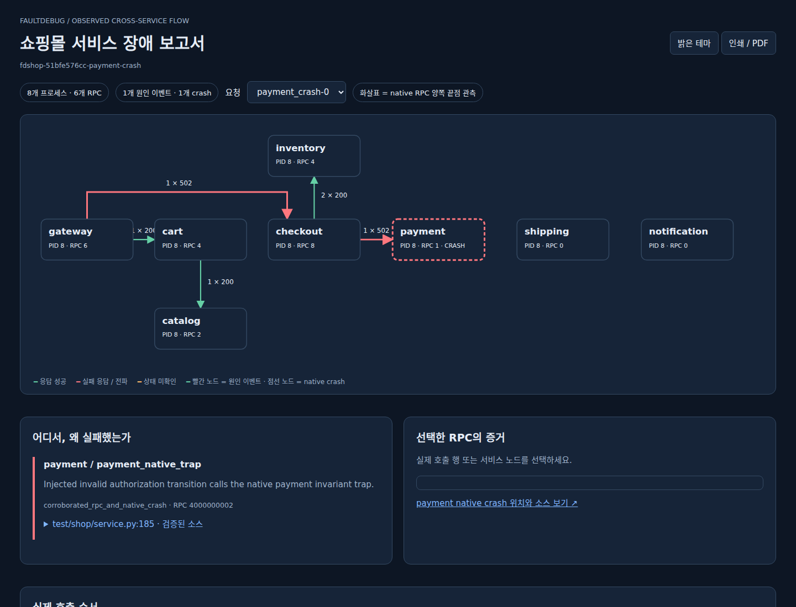
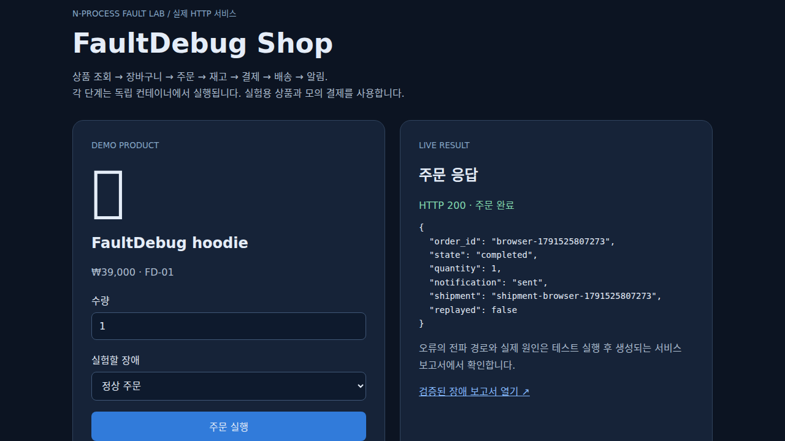

# Shopping fault laboratory validation

Executed on 2026-10-09, Linux/glibc, Python 3.12, Docker Engine 29.7.2,
Compose v5.5.0, Clang 18. Native ABI and package version remain unchanged.

## Build and regression gates

| Gate | Result | Evidence |
|---|---|---|
| Docker image with native instrumentation and immutable source bundle | PASS | `docker build -f test/shop/Dockerfile -t faultdebug-shop:dev .` |
| CMake native boundary and existing fixtures | PASS | `cmake -S . -B build -DFAULTDEBUG_BUILD_SHOP=ON -DFAULTDEBUG_PYTHON_EXECUTABLE=...`; `cmake --build build --parallel 4` |
| Native/collector regression tests | PASS | `ctest --test-dir build --output-on-failure -j2`: 23/23 |
| Namespace/trace joins and service evidence | PASS | `python test/service_report_test.py`: 13/13 |
| Existing fault reports and MCP | PASS | `python test/fault_report_test.py`: 13/13 |
| Existing RPC and incident projections | PASS | `python test/rpc_analysis.py`; `python test/incident_report.py` |
| Python sdist/wheel and installed consumer | PASS | `python -m build --sdist --wheel`; install wheel in a separate environment, run `service-report` from outside the checkout |

The consumer report produced 16 participants, 336 observed calls and 24
corroborated payment-decline events. Container UID/GID matches the invoking
user so mode-0600 `.fault` files remain accessible without broad permissions.

## Actual container scenarios

```sh
python test/shop/run.py --processes 8 --requests 4 --concurrency 2 \
  --port 8862 --output build/shop-verified-n8
python test/shop/run.py --processes 16 --requests 24 --concurrency 4 \
  --scenarios success payment_decline --port 8861 \
  --output build/shop-verified-n16
```

Tested image ID:
`sha256:fb9edab04e4bdcf9310d9eb32614f04dcfda1fa209f619ca5138ad456a746aa6`.
Both test groups used this same image. N counts application processes; each
container also runs a collector/init. All additional risk workers participated.

| N | Scenario | Orders attempted | HTTP result | Observed paired RPC calls | Result |
|---:|---|---:|---|---:|---|
| 8 | success | 4 | 200, completed; replay does not reserve/charge again | 31 | PASS |
| 8 | inventory_shortage | 4 | 409, no order/reservation/charge | 16 | PASS |
| 8 | payment_decline | 4 | 402, inventory released, no charge | 24 | PASS |
| 8 | inventory_timeout | 4 | 504; receiver deadline guard prevents late stock mutation | 16 | PASS |
| 8 | notification_failure | 4 | 200 completed order, notification deferred; native downstream 503 | 31 | PASS |
| 8 | payment_crash | 1 | native SIGILL, checkout/gateway 502, inventory released | 6 | PASS |
| 16 | success | 24 | 200, completed; replay safe | 363 | PASS |
| 16 | payment_decline | 24 | 402, all reservations released | 336 | PASS |

Total: 69 independent checkout attempts plus three replay requests, 823 paired
service calls, and 80 checksummed captures. All 80 snapshots were stable and
the RPC sidecars reported zero dropped events. 79 captures were complete;
the one deliberately crashed payment capture remained incomplete, with no
receiver end event. The injected trap explanation matched that process's
native thread, its pending RPC, and SIGILL. The actual instruction resolved
to `test/shop/boundary.cc:12`, `payment_authorization_invariant()`, through the
captured Build ID and verified source bundle. Retained native events were
nonempty. Healthy processes require complete captures in runner assertions.

The fixed eight-thread HTTP pool preserves native function ring history.
Earlier exploratory runs with a new thread per request exposed native slot
reuse gaps and are excluded from these final completeness results. The report
also propagates incomplete native snapshots; a valid RPC sidecar does not
hide missing function evidence.

Native outbound/inbound direction takes precedence over the shared `begin`
phase. End timestamps are selected when native start time is zero. Native
publication sequence is checked independently of timestamps because concurrent
callers can publish in a different order from their sampled times. Unit checks
cover equal container-local PIDs, generations, trace reuse, scope/method
mismatch, corrupt checksums, explanation absence, uncorroborated status, native
incompleteness, HTML escaping and refusal to overwrite an existing report.

## Browser and document checks

- PASS: live 16-process storefront product query and completed order.
- PASS: browser payment decline returned 402 and `reservation_released: true`.
- PASS: crash call selection showed caller 502, receiver end absent, and the
  explicit `RemoteDisconnected` symptom; separate native report opened.
- PASS: request filter selected `success-23`; 15 actual calls and all eight
  extra risk workers were retained. Dark/light switching worked.
- PASS: final flow routes preserve checkout-to-shipping and
  checkout-to-notification branches. Browser SVG path sampling found zero
  intersections with unrelated nodes. Desktop horizontal overflow was zero,
  and the standalone report made no external resource requests.
- PASS: Korean service report PDF rendered as three pages; every page was
  visually inspected. Source excerpt, actual calls and evidence limitations
  remained readable. Markdown/JSON retain the full scenario, while HTML/PDF
  can show the selected request.

Screenshots are actual rendered test output, not an architecture mockup.





## Limits and unrun gates

External client requests remain unpaired because there is no client-side native
capture. Unreached services after early failures have no RPC events. The crash
retains an incomplete stream. Missing IPC evidence is separate from this HTTP
workload. These are explicit unresolved items, not invented causal edges.

Application explanations are self-reported and separately corroborated;
checksums do not authenticate their authors. C++ boundary function traces do
not represent Python call stacks. Orders/charges are synthetic in-memory state;
notification deferral is not a delivery queue or provider delivery proof.

Kubernetes deployment, real payment/notification providers, N=32 scale runs,
long-duration soak and randomized chaos testing: **NOT RUN**. The manual
GitHub `Shopping fault lab` workflow is included for reproduction; local Docker
results alone do not claim a hosted workflow result. No release was published
as part of this feature.
